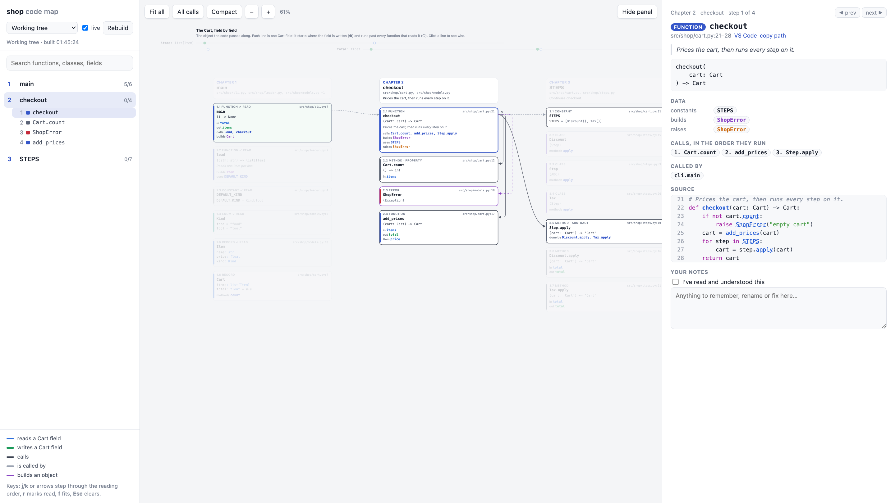
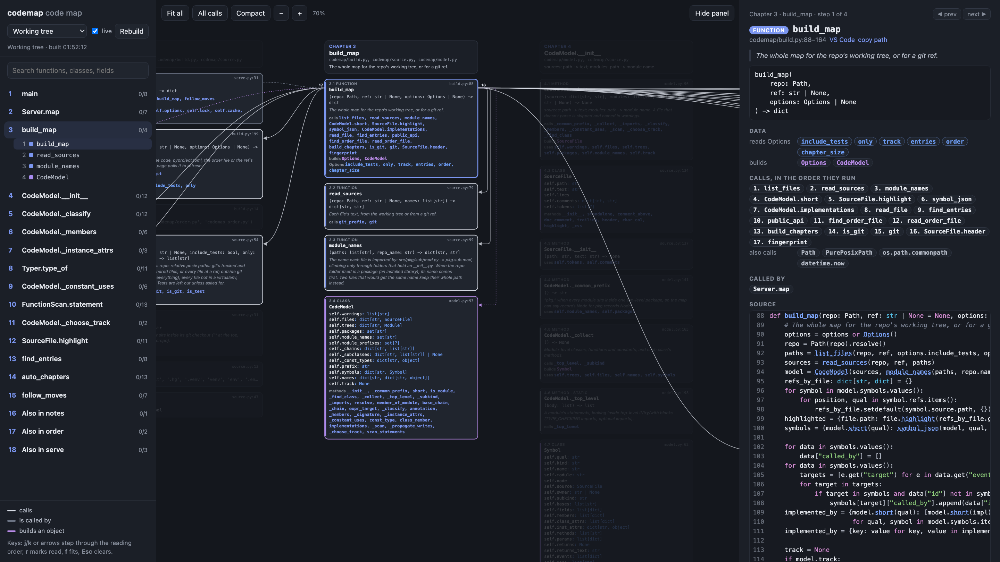
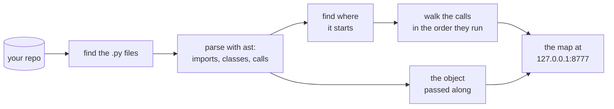

<div align="center">


# codemap

**Read any Python codebase in the order it runs.**

An interactive map of your code that starts where the program starts and follows every call,<br>
so you can read it top to bottom like a book. Runs locally, needs nothing but Python.

[](https://github.com/estrindavid/codemap/actions/workflows/tests.yml)


[](LICENSE)

<br>

<picture>
  <source media="(prefers-color-scheme: dark)" srcset="docs/hero-dark.png">
  
</picture>

</div>

<br>

Opening an unfamiliar codebase usually means jumping between files, guessing where things start. **codemap** reads the
code for you and lays it out as a reading order: `main()` first, then each function right after the code that first
calls it, each class right before the code that first builds it. Every column is a chapter of about a dozen boxes. Click
anything to see its code and connections, and tick boxes off as you go.

## Quick start

```bash
pip install git+https://github.com/estrindavid/codemap
codemap path/to/your/repo --open
```

No config and no build step, and your code never leaves your machine. The map rebuilds itself as you edit, and the
dropdown shows any git branch.

## What you get

| | |
|---|---|
| 🧭 **A reading order** | Starts at your entry points (the `pyproject.toml` command, `if __name__ == "__main__":`, `main()`, or a library's public API) and walks every call depth first, in the order it runs. |
| 🔗 **Every connection** | Click a box for its code, the calls it makes (numbered, in order), who calls it, and what it builds, raises and reads. The arrows light up on the map. |
| 🧵 **The object that flows through** | Finds the object your code passes along, such as a context, a state or a report, and draws each of its fields as a line: where it's written, where it's read. |
| 🐍 **Real Python, not grep** | Relative imports, re-exports from `__init__.py`, dataclasses, pydantic models, enums, properties, and calls through an abstract base class into every subclass. |
| ✅ **Progress and notes** | Mark boxes read and keep notes. They live in `~/.codemap`, never in your repo, and follow code that moves to another module. |
| 🔴 **Live and linkable** | Save a file and the map updates. Look at any branch. Link straight to a box: `http://127.0.0.1:8777/#records.Graph.node`. |

## It maps itself



<sub>codemap reading its own source. `build_map` makes 17 calls, numbered in the order they run.</sub>

## How it works



codemap never imports or runs your code. It reads it with Python's `ast` module and follows types just far enough to
know which method each call lands on: annotations, constructors, return types and `self` attributes.

| File | What it does |
|---|---|
| [`source.py`](codemap/source.py) | finds the files (what git knows about, or a folder walk) and names each one as it's imported |
| [`model.py`](codemap/model.py) | parses them and records what every function does, in order |
| [`order.py`](codemap/order.py) | finds the entry points and walks the calls into chapters |
| [`build.py`](codemap/build.py) | puts it all together as the JSON the page reads |
| [`serve.py`](codemap/serve.py) · [`notes.py`](codemap/notes.py) | the local server, and your notes |
| [`static/`](codemap/static) | the page: plain HTML, CSS and JavaScript, no build step |

## Keys

| | |
|---|---|
| <kbd>j</kbd> <kbd>k</kbd> or arrows | next / previous box in the reading order |
| <kbd>r</kbd> | mark the current box read |
| <kbd>f</kbd> | fit the whole map on screen |
| <kbd>+</kbd> <kbd>-</kbd> | zoom |
| <kbd>Esc</kbd> | clear the selection |

## Options

| | |
|---|---|
| `--port 8777` | where to serve the page |
| `--only src/app` | map only these folders (repeatable) |
| `--tests` | include test files (left out by default) |
| `--entry cli.main` | start the walk here (repeatable), before anything found on its own |
| `--track Report` · `--track none` | the class whose fields become lines across the top, or none |
| `--order FILE` | a hand-written order somewhere other than `.codemap/order.py` |
| `--chapter-size 12` | about how many boxes per column |
| `--notes FILE` | keep notes somewhere other than `~/.codemap` |
| `--open` | open the page in your browser |

<details>
<summary><b>Write your own reading order</b></summary>

<br>

The walk is a good first draft. To set the first chapters yourself, add `.codemap/order.py` to your repo:

```python
CHAPTERS = [
    {
        "title": "The data, first",
        "goal": "Everything the program passes around.",   # shown at the top of the column
        "items": [
            ("records.Node", "One step of the workflow."),     # (id, a note shown on the box)
            "records.Graph",                                   # or just the id
            ("cli.main", "Only the top half for now.", {"part": "start", "from": "parser =", "to": "raise SystemExit"}),
        ],
    },
]
```

An id is what the map shows for a box (click one to see it in the address bar). An id that stops matching the code is
flagged on the map, and everything your chapters leave out is placed by the walk after them.

</details>

<details>
<summary><b>Where do my notes go?</b></summary>

<br>

Read marks and notes are saved in `~/.codemap/<repo>-<hash>/notes.json`, one file per repo, shared by all its git
worktrees and never inside the repo. Each note is saved under the id of what it's about (`records.Graph.node`). When code
moves to another module (`models.Node` becomes `records.Node`), the map moves its notes along on the next build, after
backing the file up.

</details>

## Limits

codemap reads code statically, so it can't see calls made by name (`getattr`, plugin hooks, callbacks registered at
runtime) or calls on values whose type it can't work out. Those functions still get a place, in a chapter per module
after the walk. Run it with a Python at least as new as the syntax your code uses. Codebases with thousands of files
build in a few seconds but make a heavy page.

## Develop

```bash
git clone https://github.com/estrindavid/codemap && cd codemap
pip install -e ".[dev]"
pytest
```

[`tests/sample`](tests/sample) is a tiny shop app with a bit of everything the map understands. It's the one in the
screenshot at the top.

## License

[MIT](LICENSE)
